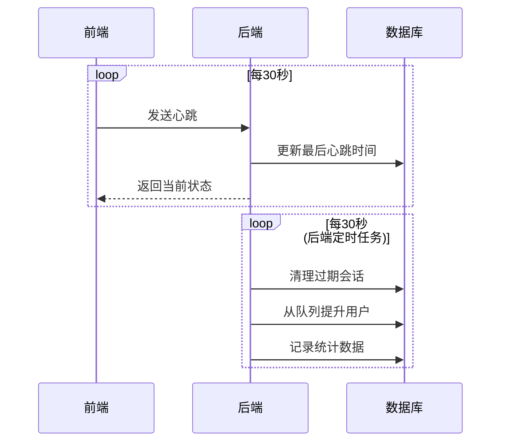

# 流量控制系统

## 概述

新的流量控制系统替代了原来简单的随机拥挤逻辑，实现了真正的后端限流 + 状态响应 + 前端加载判断的完整流程。

## 系统架构

### 前端组件

1. **TrafficStore** (`src/stores/traffic.ts`)

   - 管理流量状态和用户会话
   - 提供流量检测、加入活动、心跳等功能
   - 支持队列管理和状态同步

2. **TrafficService** (`src/services/trafficService.ts`)

   - 模拟后端流量控制逻辑
   - 实现会话管理、队列处理、心跳检测
   - 提供统计数据和配置管理

3. **增强的 CrowdingTip 组件**

   - 显示详细的流量信息
   - 支持队列位置和等待时间显示
   - 提供重试倒计时功能

4. **修改的 LoadingPage**
   - 集成真实的流量检测逻辑
   - 根据检测结果决定跳转路径
   - 支持会话管理和清理

### API 接口

#### 1. 流量检测 `/api/traffic/check`

```typescript
GET /api/traffic/check
Response: {
  code: 200,
  data: {
    status: 'ok' | 'crowded' | 'maintenance',
    currentUsers: number,
    maxUsers: number,
    queuePosition?: number,
    estimatedWaitTime?: number,
    retryAfter?: number
  }
}
```

#### 2. 加入活动 `/api/traffic/join`

```typescript
POST /api/traffic/join
Body: {
  action: 'join',
  userId?: string,
  sessionId: string
}
Response: {
  code: 200,
  data: {
    success: boolean,
    currentUsers: number,
    userStatus: 'active' | 'queued' | 'blocked'
  }
}
```

#### 3. 心跳检测 `/api/traffic/heartbeat`

```typescript
POST /api/traffic/heartbeat
Body: {
  action: 'heartbeat',
  sessionId: string
}
Response: {
  code: 200,
  data: {
    success: boolean,
    currentUsers: number,
    userStatus: 'active' | 'queued' | 'blocked'
  }
}
```

#### 4. 离开活动 `/api/traffic/leave`

```typescript
POST /api/traffic/leave
Body: {
  action: 'leave',
  sessionId: string
}
Response: {
  code: 200,
  data: {
    success: boolean,
    currentUsers: number,
    userStatus: 'idle'
  }
}
```

## 数据库设计

### 活动参与者表 (activity_participants)

```sql
CREATE TABLE activity_participants (
    id BIGINT PRIMARY KEY AUTO_INCREMENT,
    user_id VARCHAR(50) NULL,
    session_id VARCHAR(100) NOT NULL UNIQUE,
    ip_address VARCHAR(45) NULL,
    join_time DATETIME NOT NULL,
    leave_time DATETIME NULL,
    last_heartbeat DATETIME NOT NULL,
    status ENUM('active', 'queued', 'expired', 'left') NOT NULL DEFAULT 'active',
    queue_position INT NULL,
    created_at DATETIME DEFAULT CURRENT_TIMESTAMP,
    updated_at DATETIME DEFAULT CURRENT_TIMESTAMP ON UPDATE CURRENT_TIMESTAMP
);
```

### 流量控制配置表 (traffic_config)

```sql
CREATE TABLE traffic_config (
    id INT PRIMARY KEY AUTO_INCREMENT,
    config_key VARCHAR(50) NOT NULL UNIQUE,
    config_value VARCHAR(200) NOT NULL,
    description VARCHAR(500) NULL,
    is_active BOOLEAN DEFAULT TRUE,
    created_at DATETIME DEFAULT CURRENT_TIMESTAMP,
    updated_at DATETIME DEFAULT CURRENT_TIMESTAMP ON UPDATE CURRENT_TIMESTAMP
);
```

## 工作流程

### 1. 用户加入活动流程

```mermaid
sequenceDiagram
    participant U as 用户
    participant F as 前端
    participant B as 后端
    participant D as 数据库

    U->>F: 点击参与活动
    F->>F: 跳转到LoadingPage
    F->>B: 检查流量状态
    B->>D: 查询当前活跃用户数
    B-->>F: 返回流量状态

    alt 流量正常
        F->>B: 尝试加入活动
        B->>D: 创建活跃会话记录
        B-->>F: 返回成功状态
        F->>F: 跳转到倒计时页面
        F->>B: 开始发送心跳
    else 流量拥挤
        F->>B: 尝试加入活动
        B->>D: 创建排队会话记录
        B-->>F: 返回排队状态
        F->>F: 显示拥挤提示
    end
```



### 2. 心跳和会话管理



## 配置参数

### 默认配置

- **最大并发用户数**: 1000
- **队列超时时间**: 300 秒 (5 分钟)
- **心跳超时时间**: 60 秒 (1 分钟)
- **心跳发送间隔**: 30 秒
- **重试冷却时间**: 60 秒

### 高峰期配置

- **高峰期时间**: 11:00-14:00, 17:00-20:00
- **高峰期最大用户数**: 800 (降低 20%)
- **高峰期拥挤概率**: 70%

## 测试和调试

### 测试页面

访问 `/traffic-test` 可以进入流量控制系统测试页面，提供以下功能：

- 实时查看流量状态
- 测试加入/离开活动
- 查看会话信息
- 重置系统状态

### 开发模式

在开发环境中，系统使用模拟的流量控制服务，支持：

- 基于时间的智能拥挤判断
- 真实的队列管理
- 会话超时处理
- 统计数据收集

### 生产部署

生产环境需要：

1. 实现后端 API 接口
2. 创建数据库表结构
3. 配置定时任务
4. 设置监控和告警

## 优势

1. **真实限流**: 基于实际用户数量进行限流，而非随机
2. **队列管理**: 支持用户排队，提供预估等待时间
3. **会话管理**: 通过心跳机制管理用户会话
4. **数据统计**: 收集详细的流量数据用于分析
5. **配置灵活**: 支持动态调整限流参数
6. **用户体验**: 提供详细的状态信息和重试机制

## 监控指标

- 实时活跃用户数
- 队列长度和等待时间
- 会话超时率
- API 响应时间
- 系统资源使用率
- 用户转化率 (从排队到成功参与)

## 高级功能

### 1. 智能流量预测

基于历史数据预测流量高峰，提前调整限流策略：

```typescript
// 流量预测服务
class TrafficPredictionService {
  // 基于历史数据预测未来1小时的流量
  async predictTraffic(timeRange: number = 3600): Promise<TrafficPrediction> {
    const historicalData = await this.getHistoricalTraffic();
    const currentTrend = this.analyzeTrend(historicalData);

    return {
      predictedPeakTime: this.calculatePeakTime(currentTrend),
      expectedUsers: this.estimateUserCount(currentTrend),
      recommendedCapacity: this.calculateOptimalCapacity(currentTrend),
      confidence: this.calculateConfidence(historicalData),
    };
  }

  // 动态调整限流参数
  async adjustCapacityBasedOnPrediction(): Promise<void> {
    const prediction = await this.predictTraffic();

    if (prediction.confidence > 0.8) {
      await this.updateTrafficConfig({
        maxConcurrentUsers: prediction.recommendedCapacity,
        queueTimeoutSeconds: this.calculateQueueTimeout(
          prediction.expectedUsers
        ),
      });
    }
  }
}
```

### 2. 地域分流策略

根据用户地理位置实现智能分流：

```typescript
// 地域分流配置
interface RegionConfig {
  region: string;
  maxUsers: number;
  priority: number;
  serverEndpoint: string;
}

class RegionBasedTrafficControl {
  private regionConfigs: Map<string, RegionConfig> = new Map();

  async routeUserByRegion(userIP: string): Promise<string> {
    const region = await this.detectUserRegion(userIP);
    const config = this.regionConfigs.get(region);

    if (!config) {
      return this.getDefaultEndpoint();
    }

    const currentLoad = await this.getRegionLoad(region);
    if (currentLoad < config.maxUsers) {
      return config.serverEndpoint;
    }

    // 寻找负载较低的相邻区域
    return this.findAlternativeRegion(region);
  }

  private async detectUserRegion(ip: string): Promise<string> {
    // 使用IP地址检测用户地理位置
    // 可以集成第三方地理位置服务
    return "default";
  }
}
```

### 3. 用户优先级系统

为不同类型用户设置不同的优先级：

```typescript
enum UserPriority {
  VIP = 1,
  PREMIUM = 2,
  REGULAR = 3,
  NEW = 4,
}

interface PriorityUser {
  userId: string;
  priority: UserPriority;
  skipQueue: boolean;
  maxRetries: number;
}

class PriorityTrafficControl {
  async joinWithPriority(user: PriorityUser): Promise<JoinResult> {
    // VIP用户直接通过
    if (user.priority === UserPriority.VIP || user.skipQueue) {
      return await this.directJoin(user.userId);
    }

    // 其他用户按优先级排队
    const queuePosition = await this.calculatePriorityPosition(user);
    return {
      success: false,
      userStatus: "queued",
      queuePosition,
      estimatedWaitTime: this.calculateWaitTime(queuePosition, user.priority),
    };
  }

  private async calculatePriorityPosition(user: PriorityUser): Promise<number> {
    const queue = await this.getCurrentQueue();
    let position = 0;

    for (const queuedUser of queue) {
      if (queuedUser.priority <= user.priority) {
        position++;
      }
    }

    return position + 1;
  }
}
```

### 4. 实时流量监控面板

创建管理员监控界面：

```vue
<!-- TrafficMonitorDashboard.vue -->
<template>
  <div class="traffic-monitor">
    <div class="stats-grid">
      <div class="stat-card">
        <h3>实时用户数</h3>
        <div class="stat-value">{{ stats.activeUsers }}</div>
        <div class="stat-trend" :class="userTrend">
          {{ userTrendText }}
        </div>
      </div>

      <div class="stat-card">
        <h3>队列长度</h3>
        <div class="stat-value">{{ stats.queueLength }}</div>
        <div class="stat-detail">平均等待: {{ stats.avgWaitTime }}分钟</div>
      </div>

      <div class="stat-card">
        <h3>系统负载</h3>
        <div class="stat-value">{{ stats.systemLoad }}%</div>
        <div class="progress-bar">
          <div
            class="progress"
            :style="{ width: stats.systemLoad + '%' }"
          ></div>
        </div>
      </div>

      <div class="stat-card">
        <h3>成功率</h3>
        <div class="stat-value">{{ stats.successRate }}%</div>
        <div class="stat-detail">今日: {{ stats.todayJoins }} 次参与</div>
      </div>
    </div>

    <!-- 实时流量图表 -->
    <div class="chart-container">
      <canvas ref="trafficChart"></canvas>
    </div>

    <!-- 控制面板 -->
    <div class="control-panel">
      <div class="control-group">
        <label>最大用户数</label>
        <input v-model="config.maxUsers" type="number" @change="updateConfig" />
      </div>

      <div class="control-group">
        <label>维护模式</label>
        <switch v-model="config.maintenanceMode" @change="toggleMaintenance" />
      </div>

      <button @click="clearQueue" class="btn-danger">清空队列</button>
    </div>
  </div>
</template>

<script setup lang="ts">
import { ref, onMounted, onUnmounted } from "vue";
import { Chart } from "chart.js";

const stats = ref({
  activeUsers: 0,
  queueLength: 0,
  systemLoad: 0,
  successRate: 0,
  avgWaitTime: 0,
  todayJoins: 0,
});

const config = ref({
  maxUsers: 1000,
  maintenanceMode: false,
});

let updateInterval: number;
let trafficChart: Chart;

onMounted(() => {
  initChart();
  startRealTimeUpdates();
});

onUnmounted(() => {
  clearInterval(updateInterval);
  trafficChart?.destroy();
});

function initChart() {
  const canvas = trafficChart.value as HTMLCanvasElement;
  const ctx = canvas.getContext("2d");

  trafficChart = new Chart(ctx, {
    type: "line",
    data: {
      labels: [],
      datasets: [
        {
          label: "活跃用户数",
          data: [],
          borderColor: "#3b82f6",
          backgroundColor: "rgba(59, 130, 246, 0.1)",
          tension: 0.4,
        },
        {
          label: "队列长度",
          data: [],
          borderColor: "#ef4444",
          backgroundColor: "rgba(239, 68, 68, 0.1)",
          tension: 0.4,
        },
      ],
    },
    options: {
      responsive: true,
      scales: {
        y: {
          beginAtZero: true,
        },
      },
    },
  });
}

function startRealTimeUpdates() {
  updateInterval = setInterval(async () => {
    const newStats = await fetchTrafficStats();
    stats.value = newStats;
    updateChart(newStats);
  }, 5000);
}

async function updateConfig() {
  await fetch("/api/traffic/config", {
    method: "PUT",
    headers: { "Content-Type": "application/json" },
    body: JSON.stringify(config.value),
  });
}

async function clearQueue() {
  if (confirm("确定要清空所有排队用户吗？")) {
    await fetch("/api/traffic/queue/clear", { method: "POST" });
  }
}
</script>
```

### 5. 自动扩缩容机制

根据流量自动调整系统容量：

```typescript
class AutoScalingService {
  private scaleUpThreshold = 0.8; // 80%负载时扩容
  private scaleDownThreshold = 0.3; // 30%负载时缩容
  private cooldownPeriod = 300000; // 5分钟冷却期

  async monitorAndScale(): Promise<void> {
    const currentLoad = await this.getCurrentLoad();
    const lastScaleTime = await this.getLastScaleTime();

    // 检查是否在冷却期内
    if (Date.now() - lastScaleTime < this.cooldownPeriod) {
      return;
    }

    if (currentLoad > this.scaleUpThreshold) {
      await this.scaleUp();
    } else if (currentLoad < this.scaleDownThreshold) {
      await this.scaleDown();
    }
  }

  private async scaleUp(): Promise<void> {
    const currentCapacity = await this.getCurrentCapacity();
    const newCapacity = Math.min(currentCapacity * 1.5, 5000); // 最大5000用户

    await this.updateCapacity(newCapacity);
    await this.recordScaleEvent("up", currentCapacity, newCapacity);

    console.log(`扩容: ${currentCapacity} -> ${newCapacity}`);
  }

  private async scaleDown(): Promise<void> {
    const currentCapacity = await this.getCurrentCapacity();
    const newCapacity = Math.max(currentCapacity * 0.7, 500); // 最小500用户

    await this.updateCapacity(newCapacity);
    await this.recordScaleEvent("down", currentCapacity, newCapacity);

    console.log(`缩容: ${currentCapacity} -> ${newCapacity}`);
  }
}
```

### 6. 异常恢复机制

系统异常时的自动恢复策略：

```typescript
class DisasterRecoveryService {
  private healthCheckInterval = 30000; // 30秒健康检查
  private maxFailures = 3;
  private currentFailures = 0;

  async startHealthMonitoring(): Promise<void> {
    setInterval(async () => {
      try {
        await this.performHealthCheck();
        this.currentFailures = 0; // 重置失败计数
      } catch (error) {
        this.currentFailures++;
        await this.handleHealthCheckFailure(error);
      }
    }, this.healthCheckInterval);
  }

  private async performHealthCheck(): Promise<void> {
    // 检查数据库连接
    await this.checkDatabaseHealth();

    // 检查API响应时间
    await this.checkAPIHealth();

    // 检查内存使用情况
    await this.checkMemoryHealth();
  }

  private async handleHealthCheckFailure(error: Error): Promise<void> {
    console.error("健康检查失败:", error);

    if (this.currentFailures >= this.maxFailures) {
      // 启动紧急模式
      await this.activateEmergencyMode();
    }
  }

  private async activateEmergencyMode(): Promise<void> {
    console.log("启动紧急模式");

    // 降低系统容量
    await this.reduceSystemCapacity(0.5);

    // 启用维护模式
    await this.enableMaintenanceMode();

    // 发送告警通知
    await this.sendAlertNotification("系统进入紧急模式");

    // 尝试自动恢复
    setTimeout(() => this.attemptAutoRecovery(), 60000);
  }

  private async attemptAutoRecovery(): Promise<void> {
    try {
      await this.performHealthCheck();

      // 健康检查通过，逐步恢复
      await this.gradualRecovery();
    } catch (error) {
      // 恢复失败，等待人工干预
      await this.sendAlertNotification("自动恢复失败，需要人工干预");
    }
  }
}
```

## 性能优化建议

### 1. 数据库优化

```sql
-- 为高频查询添加索引
CREATE INDEX idx_participants_status_heartbeat ON activity_participants(status, last_heartbeat);
CREATE INDEX idx_participants_session_id ON activity_participants(session_id);
CREATE INDEX idx_participants_join_time ON activity_participants(join_time);

-- 分区表优化（按日期分区）
ALTER TABLE activity_participants
PARTITION BY RANGE (TO_DAYS(join_time)) (
    PARTITION p_2024_01 VALUES LESS THAN (TO_DAYS('2024-02-01')),
    PARTITION p_2024_02 VALUES LESS THAN (TO_DAYS('2024-03-01')),
    -- 继续添加更多分区...
);
```

### 2. 缓存策略

```typescript
class TrafficCacheService {
  private redis: Redis;
  private cacheKeys = {
    activeUsers: "traffic:active_users",
    queueLength: "traffic:queue_length",
    systemConfig: "traffic:config",
  };

  async getActiveUserCount(): Promise<number> {
    const cached = await this.redis.get(this.cacheKeys.activeUsers);
    if (cached) {
      return parseInt(cached);
    }

    const count = await this.queryActiveUsersFromDB();
    await this.redis.setex(this.cacheKeys.activeUsers, 30, count.toString());
    return count;
  }

  async invalidateCache(key: string): Promise<void> {
    await this.redis.del(key);
  }
}
```

### 3. 连接池优化

```typescript
// 数据库连接池配置
const dbConfig = {
  host: process.env.DB_HOST,
  port: parseInt(process.env.DB_PORT || "3306"),
  user: process.env.DB_USER,
  password: process.env.DB_PASSWORD,
  database: process.env.DB_NAME,
  connectionLimit: 50,
  acquireTimeout: 60000,
  timeout: 60000,
  reconnect: true,
};
```

## 部署和运维

### Docker 部署配置

```dockerfile
# Dockerfile
FROM node:18-alpine

WORKDIR /app

COPY package*.json ./
RUN npm ci --only=production

COPY . .

EXPOSE 3000

CMD ["npm", "start"]
```

```yaml
# docker-compose.yml
version: "3.8"
services:
  traffic-control:
    build: .
    ports:
      - "3000:3000"
    environment:
      - NODE_ENV=production
      - DB_HOST=mysql
      - REDIS_HOST=redis
    depends_on:
      - mysql
      - redis

  mysql:
    image: mysql:8.0
    environment:
      MYSQL_ROOT_PASSWORD: rootpassword
      MYSQL_DATABASE: traffic_control
    volumes:
      - mysql_data:/var/lib/mysql

  redis:
    image: redis:7-alpine
    volumes:
      - redis_data:/data

volumes:
  mysql_data:
  redis_data:
```

### 监控和告警配置

```yaml
# prometheus.yml
global:
  scrape_interval: 15s

scrape_configs:
  - job_name: "traffic-control"
    static_configs:
      - targets: ["localhost:3000"]
    metrics_path: "/metrics"
```

这个完整的流量控制系统现在包含了：

1. **智能流量预测** - 基于历史数据预测流量高峰
2. **地域分流** - 根据用户位置智能路由
3. **用户优先级** - VIP 用户优先通道
4. **实时监控面板** - 管理员可视化界面
5. **自动扩缩容** - 根据负载自动调整容量
6. **异常恢复** - 系统故障时自动恢复
7. **性能优化** - 数据库、缓存、连接池优化
8. **部署运维** - Docker 化部署和监控配置

这样就构建了一个企业级的流量控制系统！
