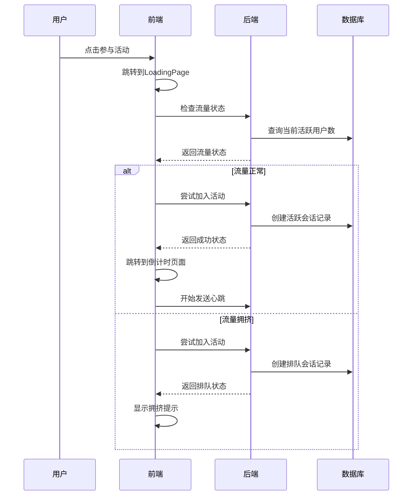
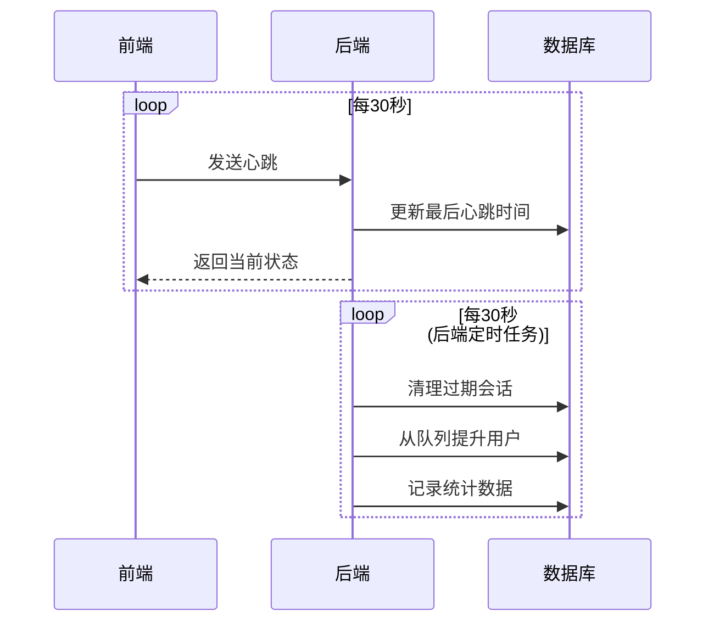

# 流量控制系统

## 概述

新的流量控制系统替代了原来简单的随机拥挤逻辑，实现了真正的后端限流 + 状态响应 + 前端加载判断的完整流程。

## 系统架构

### 前端组件

1. **TrafficStore** (`src/stores/traffic.ts`)
   - 管理流量状态和用户会话
   - 提供流量检测、加入活动、心跳等功能
   - 支持队列管理和状态同步

2. **TrafficService** (`src/services/trafficService.ts`)
   - 模拟后端流量控制逻辑
   - 实现会话管理、队列处理、心跳检测
   - 提供统计数据和配置管理

3. **增强的CrowdingTip组件**
   - 显示详细的流量信息
   - 支持队列位置和等待时间显示
   - 提供重试倒计时功能

4. **修改的LoadingPage**
   - 集成真实的流量检测逻辑
   - 根据检测结果决定跳转路径
   - 支持会话管理和清理

### API接口

#### 1. 流量检测 `/api/traffic/check`
```typescript
GET /api/traffic/check
Response: {
  code: 200,
  data: {
    status: 'ok' | 'crowded' | 'maintenance',
    currentUsers: number,
    maxUsers: number,
    queuePosition?: number,
    estimatedWaitTime?: number,
    retryAfter?: number
  }
}
```

#### 2. 加入活动 `/api/traffic/join`
```typescript
POST /api/traffic/join
Body: {
  action: 'join',
  userId?: string,
  sessionId: string
}
Response: {
  code: 200,
  data: {
    success: boolean,
    currentUsers: number,
    userStatus: 'active' | 'queued' | 'blocked'
  }
}
```

#### 3. 心跳检测 `/api/traffic/heartbeat`
```typescript
POST /api/traffic/heartbeat
Body: {
  action: 'heartbeat',
  sessionId: string
}
Response: {
  code: 200,
  data: {
    success: boolean,
    currentUsers: number,
    userStatus: 'active' | 'queued' | 'blocked'
  }
}
```

#### 4. 离开活动 `/api/traffic/leave`
```typescript
POST /api/traffic/leave
Body: {
  action: 'leave',
  sessionId: string
}
Response: {
  code: 200,
  data: {
    success: boolean,
    currentUsers: number,
    userStatus: 'idle'
  }
}
```

## 数据库设计

### 活动参与者表 (activity_participants)
```sql
CREATE TABLE activity_participants (
    id BIGINT PRIMARY KEY AUTO_INCREMENT,
    user_id VARCHAR(50) NULL,
    session_id VARCHAR(100) NOT NULL UNIQUE,
    ip_address VARCHAR(45) NULL,
    join_time DATETIME NOT NULL,
    leave_time DATETIME NULL,
    last_heartbeat DATETIME NOT NULL,
    status ENUM('active', 'queued', 'expired', 'left') NOT NULL DEFAULT 'active',
    queue_position INT NULL,
    created_at DATETIME DEFAULT CURRENT_TIMESTAMP,
    updated_at DATETIME DEFAULT CURRENT_TIMESTAMP ON UPDATE CURRENT_TIMESTAMP
);
```

### 流量控制配置表 (traffic_config)
```sql
CREATE TABLE traffic_config (
    id INT PRIMARY KEY AUTO_INCREMENT,
    config_key VARCHAR(50) NOT NULL UNIQUE,
    config_value VARCHAR(200) NOT NULL,
    description VARCHAR(500) NULL,
    is_active BOOLEAN DEFAULT TRUE,
    created_at DATETIME DEFAULT CURRENT_TIMESTAMP,
    updated_at DATETIME DEFAULT CURRENT_TIMESTAMP ON UPDATE CURRENT_TIMESTAMP
);
```

## 工作流程

### 1. 用户加入活动流程



### 2. 心跳和会话管理



## 配置参数

### 默认配置
- **最大并发用户数**: 1000
- **队列超时时间**: 300秒 (5分钟)
- **心跳超时时间**: 60秒 (1分钟)
- **心跳发送间隔**: 30秒
- **重试冷却时间**: 60秒

### 高峰期配置
- **高峰期时间**: 11:00-14:00, 17:00-20:00
- **高峰期最大用户数**: 800 (降低20%)
- **高峰期拥挤概率**: 70%

## 测试和调试

### 测试页面
访问 `/traffic-test` 可以进入流量控制系统测试页面，提供以下功能：
- 实时查看流量状态
- 测试加入/离开活动
- 查看会话信息
- 重置系统状态

### 开发模式
在开发环境中，系统使用模拟的流量控制服务，支持：
- 基于时间的智能拥挤判断
- 真实的队列管理
- 会话超时处理
- 统计数据收集

### 生产部署
生产环境需要：
1. 实现后端API接口
2. 创建数据库表结构
3. 配置定时任务
4. 设置监控和告警

## 优势

1. **真实限流**: 基于实际用户数量进行限流，而非随机
2. **队列管理**: 支持用户排队，提供预估等待时间
3. **会话管理**: 通过心跳机制管理用户会话
4. **数据统计**: 收集详细的流量数据用于分析
5. **配置灵活**: 支持动态调整限流参数
6. **用户体验**: 提供详细的状态信息和重试机制

## 监控指标

- 实时活跃用户数
- 队列长度和等待时间
- 会话超时率
- API响应时间
- 系统资源使用率
- 用户转化率 (从排队到成功参与)