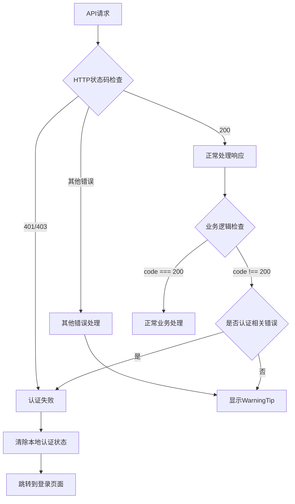

# 认证错误处理优化

## 问题描述

当用户未登录时，从登录页面退出或API返回非200状态码（如401认证失败），系统不应该显示WarningTip，而应该直接跳转到登录页面。

## 优化方案

### 1. LoadingPage认证错误处理优化

**文件**: `rain-of-coupon/src/views/LoadingPage.vue`

**优化内容**:
- 扩展了认证失败的检测条件，包括401、403状态码
- 增加了更多认证失败相关的错误消息检测
- 当检测到认证失败时，自动清除本地认证状态并跳转到登录页面
- 添加了redirect参数，登录成功后可以返回到loading页面

**关键改进**:
```javascript
// 检查是否是认证失败（401、403或相关错误消息）
if (response.code === 401 || response.code === 403 ||
    (response.msg && (response.msg.includes('认证失败') || 
                     response.msg.includes('无法访问') || 
                     response.msg.includes('未登录') ||
                     response.msg.includes('未授权') ||
                     response.msg.includes('token') ||
                     response.msg.includes('Token') ||
                     response.msg.includes('Unauthorized') ||
                     response.msg.includes('Forbidden') ||
                     response.msg.includes('请先登录')))) {
  console.log('❌ [LoadingPage] 认证失败，清除本地认证状态并跳转到登录页面')
  // 清除本地认证状态
  authStore.logout()
  router.push('/login?redirect=/loading')
  return
}
```

### 2. API请求错误处理优化

**文件**: `rain-of-coupon/src/api/lottery.ts`

**优化内容**:
- 改进了HTTP错误处理，即使状态码不是200也会尝试解析响应数据
- 在错误对象中包含HTTP状态码信息
- 提供更详细的错误日志

**关键改进**:
```javascript
// 如果HTTP状态码不是200，创建包含状态码的错误
if (!response.ok) {
  console.error('❌ [Request] HTTP错误:', response.status, response.statusText);
  const error = new Error(`HTTP error! status: ${response.status}`) as any;
  error.status = response.status;
  error.statusText = response.statusText;
  error.response = data;
  throw error;
}
```

**文件**: `rain-of-coupon/src/utils/request.ts`

**优化内容**:
- 同样的错误处理优化，确保通用请求工具也能正确处理认证错误

### 3. 错误处理流程



## 测试验证

创建了测试页面 `rain-of-coupon/test-auth-error-handling.html` 用于验证认证错误处理：

### 测试场景
1. **有效认证测试** - 验证正常认证流程
2. **无效认证测试** - 验证无效token处理
3. **401错误测试** - 验证未认证用户处理
4. **403错误测试** - 验证权限不足处理
5. **网络错误测试** - 验证网络异常处理

### 使用方法
1. 启动后端服务
2. 在浏览器中打开 `test-auth-error-handling.html`
3. 点击不同的测试按钮验证各种场景

## 预期效果

### 认证失败场景
- 用户未登录访问需要认证的页面
- Token过期或无效
- 权限不足

**处理结果**: 自动清除本地认证状态，跳转到登录页面，不显示WarningTip

### 其他错误场景
- 网络错误
- 服务器内部错误（500）
- 业务逻辑错误

**处理结果**: 显示WarningTip，提示用户稍后重试

## 安全考虑

1. **自动清除认证状态**: 当检测到认证失败时，自动清除本地存储的token和用户信息
2. **重定向保护**: 登录成功后可以返回到原来的页面
3. **错误信息保护**: 不在前端暴露敏感的后端错误信息
4. **多层检测**: 同时检查HTTP状态码和业务响应码，确保不遗漏认证错误

## 兼容性

- 兼容现有的认证流程
- 不影响其他页面的错误处理逻辑
- 保持与后端API的兼容性

## 后续优化建议

1. **统一错误处理**: 考虑创建全局的错误处理拦截器
2. **Token刷新**: 实现自动token刷新机制
3. **错误重试**: 对于网络错误实现自动重试机制
4. **用户体验**: 优化错误提示的用户体验